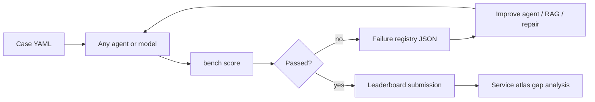

# Training feedback loop (public)

CloudBench is an **open benchmark**: failed runs produce structured artifacts that
**any** team can use to improve agents, RAG, and repair — not only the CloudBot
reference pipeline.

---

## Public loop

1. Run a case with your agent or model.
2. Score with `bench score` ([`../harness/`](../harness/)).
3. On failure, export a record per [`FAILURE_REGISTRY.md`](FAILURE_REGISTRY.md).
4. Fix and re-run; on success, submit per [`LEADERBOARD.md`](LEADERBOARD.md).

CloudBot consumes the same failure format as one reference implementation (see
CloudBot paper2 metrics + experience store).

---

## Failure modes by tier

| Tier | Typical failures | What to fix |
|------|------------------|-------------|
| L1 | Missing IAM/SG in graph; invalid Terraform | Architecture design, Engineer prompts/RAG |
| L2 | Plan errors, policy violations | Repair examples, security_contract |
| L3 | Apply timeout, wrong AMI/region | Repair loop, case hints |
| L4 | Probe mismatch (JDK, config.yml) | Analyst run_instructions, validation tuning |

Map each failure to `stage` and `failure_mode` in the registry schema.

---

## Artifacts to export

- `bench score -o score.json` output
- [`FAILURE_REGISTRY.md`](FAILURE_REGISTRY.md) JSON on fail
- Optional: `metrics.json`, repair logs (no secrets)

---

## Building-block progression

Run **lower blocks first** (B0–B1 before B2 S3). Each block adds a service;
regressions show which skill broke. See [`SERVICE_ATLAS.md`](SERVICE_ATLAS.md).

---

## Community vs reference agent

| Role | Framing |
|------|---------|
| **Community** | Use failures to improve any agent; publish ablations on leaderboard |
| **CloudBot** | Reference pipeline; demonstrates one multi-agent approach |

CloudBench does not exist to train a single product — it exists to measure
repo-to-cloud deployment for everyone. See [`PUBLIC_VISION.md`](PUBLIC_VISION.md).

---

## Governance

- L3–L4 runs require cloud approval and respect `cost_ceiling_usd` when set.
- Re-pin case commits when app repos change; re-run L1 matrix before claiming a release.
