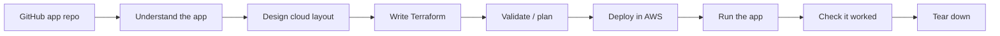

# CloudBench — updated plan (synthesized)

This document merges the original benchmark plan with your feedback. It uses plain language and focuses on **what we are measuring**: can a system take a **GitHub app repo** and **deploy it in the cloud**, then prove it works?

---

## The core idea (one paragraph)

Most benchmarks test **code** (write a function, fix a bug) or **infrastructure templates** (write Terraform from a text prompt). Neither asks the full question: *given a real application in a repo, can you figure out what cloud resources it needs, create them, run the app, fix what breaks, and tear down cleanly?* That is the **repo → cloud** path. **CloudBench** measures that path in steps, starting with simple cases (one server) and building up to apps with storage, databases, load balancers, and serverless pieces.

---

## What CloudBench is (and is not)

| | CloudBench | CloudBot |
|---|---|---|
| **Role** | The benchmark — test cases, scoring rules, paper | The reference system we test first |
| **Name** | **CloudBench** (recommended) | Stays CloudBot |
| **Who can use it** | Any agent or pipeline | One implementation |

**CloudBot-Bench** is fine as a subtitle in the CloudBot paper, but **CloudBench** is shorter and does not imply only CloudBot can run it. No other published benchmark uses this exact name for repo-to-cloud deployment (some unrelated products use “cloud benchmark” for cost/DB tests — our full paper title disambiguates).

---

## The process we evaluate

We score **how far** a run gets (see tiers below). Failures at early steps show which building block or service needs more work.

---

## Building blocks — learn simple before complex

Cloud services stack like LEGO. If a model cannot create **one EC2 instance**, it will fail when the app also needs **S3 + a database + a load balancer**.

| Step | What we test | Example |
|------|--------------|---------|
| B0 | One compute instance + basic security | UC1 wordcount (`run.sh`) |
| B1 | B0 + runtime (Java, Node, etc.) | UC2/UC3 image/video apps |
| B2 | B1 + object storage (S3) | Batch job reads/writes S3 |
| B3 | B1 + database | Small API + Postgres |
| B4 | Web tier + load balancer + DB | Three-tier app |
| B5 | Serverless (Lambda + queue) | Event-driven pipeline |

**How we use results:** run cheap checks (L1) on all blocks; only spend cloud money on blocks where agents already pass the basics. Failed cases export via the failure registry for any team to improve from.

---

## Repo layout — one repo per application

**Decision: one GitHub repo per benchmark case** (how real teams work).

- `cloudbot-benchmarking` = specs, paper, harness (this folder)
- `cloudbot_uc1`, `cloudbot_uc2`, … = one app each
- Future cases: `cloudbench-bb-s3-batch`, etc.

We are **not** putting multiple apps in one repo for v1. Consolidation can come later if needed.

---

## How we score (four levels)

| Level | What happens | AWS cost |
|-------|--------------|----------|
| **L1** | Check artifacts only: did we understand the repo? Does Terraform list the right resource types? Does `terraform validate` pass? | None |
| **L2** | Run `terraform plan` (needs read-only AWS creds) | Low |
| **L3** | Apply, deploy, capture proof, destroy | Full — **owner approval only** |
| **L4** | L3 + run the app and check output (exit code, HTTP, logs) | Full — **owner approval only** |

This lets IaC-only baselines compete on L1–L2 without claiming full repo-to-cloud.

---

## Related work (expanded search)

We are **not** limited to arXiv. Sources: arXiv, NeurIPS/ICML/ACL proceedings, **IEEE Xplore** (catalog + open preprints where available), **Google Scholar**, Amazon Science, OpenReview.

### Closest neighbors (what they test vs what we test)

| Work | They give the model | They check | Gap we fill |
|------|---------------------|------------|-------------|
| **IaC-Eval** | Text description | Terraform + plan | No app repo |
| **DPIaC-Eval** | Text requirement | Deploy template | No app workload |
| **Multi-IaC-Eval** | Edit existing IaC | Syntax / mutation | Not from app repo |
| **SWE-InfraBench** | CDK repo + edit task | Unit tests on CDK | Edit IaC, not deploy app from repo |
| **SWE-bench** | Repo + GitHub issue | Unit tests after patch | Fix code, not cloud |
| **CSR-Bench** | Research code repo | Local env setup | Local, not cloud |
| **DevOps-Gym** | Repo + DevOps task | Build/test/monitor | No full cloud provision ladder |
| **ITBench** | K8s incident scenario | Fix running system | Ops on existing cluster, not greenfield deploy |
| **DevBench / SaaSBench** | Build software from PRD | Tests / full stack | Build app, not “this repo → AWS” |
| **AgentBench / WebArena** | Simulated environments | Task success in sim | Not cloud deployment |

Full matrix: [`literature/related-work-matrix.md`](../literature/related-work-matrix.md).

### Literature corpus tiers

1. **IaC benchmarks** — IaC-Eval, DPIaC, Multi-IaC, GenSIaC, TerraDS, SWE-InfraBench, MACOG (uses IaC-Eval)
2. **Coding / repo agents** — SWE-bench, LiveCodeBench, HumanEval, ML-Bench, DevBench, LoCoBench, SaaSBench
3. **Ops / agents** — CSR-Bench, DevOps-Gym, ITBench, AgentBench, WebArena

Download: `bash scripts/download_literature.sh`  
Paywalled IEEE entries: [`literature/IEEE_SCHOLAR_CATALOG.md`](../literature/IEEE_SCHOLAR_CATALOG.md)

---

## Corpus v1 → v2

**v1 (now):**

- UC1–UC3 with **pinned commit SHAs**
- L1 harness: `bench validate`, `bench score --tier L1`
- Paper outline + repo-layout decision doc

**v2 (next):**

- Publish B2–B5 app repos (one repo each)
- L3–L4 runs with baselines (cloud-gated)
- Zenodo artifact bundle

---

## Open improvement loop

1. Run CloudBench at L1 across building blocks.
2. Tag failures: block, stage, service (failure registry schema).
3. Any agent team uses exports to improve RAG, repair, or prompts.
4. Re-run the block where performance broke.
5. When L1 is stable, optional L3–L4 (with approval).

Details: [`TRAINING_LOOP.md`](TRAINING_LOOP.md). Scope: [`PUBLIC_BOUNDARIES.md`](PUBLIC_BOUNDARIES.md).

---

## Paper (plain goal)

**Title (working):** *CloudBench: An Execution-Based Benchmark for Repository-to-Cloud Deployment*

**Message:** Prior work stops at code or templates. CloudBench is the first benchmark that scores the **full path from app repo to running cloud deployment**, with a progressive building-block ladder and optional repair/reuse metrics.

Outline: [`paper/outline.md`](../paper/outline.md).

---

## Design docs (public)

- [`PUBLIC_VISION.md`](PUBLIC_VISION.md) — model-provider + researcher benchmark goal
- [`SERVICE_ATLAS.md`](SERVICE_ATLAS.md) — service coverage phases
- [`LEADERBOARD.md`](LEADERBOARD.md) — submission protocol
- [`FAILURE_REGISTRY.md`](FAILURE_REGISTRY.md) — failure export schema
- [`TRAINING_LOOP.md`](TRAINING_LOOP.md) — open improvement loop
- [`PUBLIC_BOUNDARIES.md`](PUBLIC_BOUNDARIES.md) — separation from private CloudBot vision

---

## Execution order (unchanged + vision synthesis)

1. ~~Scaffold + literature catalog~~
2. ~~Download Tier 1–2 PDFs~~ → **extend** with SWE-InfraBench, ITBench, DevBench, ML-Bench, AgentBench (see download script)
3. ~~Related-work matrix~~ → **expand** with SOTA rows + simpler summaries
4. ~~Case YAML + pinned SHAs~~
5. ~~Multi-repo default documented~~
6. ~~Paper outline~~
7. ~~L1 harness + tests~~
8. Design L2–L5 repos + placeholder case YAMLs
9. L3–L4 protocol (documented; runs gated)
10. **Ongoing:** IEEE/Scholar pass for any missing citations; one-page notes per new paper

---

## What we still will not do without approval

- `terraform apply` / `destroy` / AWS CLI mutations
- Claim leaderboard numbers until harness + pins are frozen

## Added 2026-06-11 — benchmark telemetry (from the CloudBot learning-loop work)
11. **Capture every harness run as an outcome record.** `bench validate` / `bench score` (and the
    future leaderboard intake) should write the same outcome-record shape CloudBot uses
    (stage, failure_mode, detail — see cloudbot-paper2 `cloudbot_common/outcome.py`), so benchmark
    usage itself becomes telemetry: which cases trip users, where errors cluster (local env, clone,
    provider auth, CI), and what feeds the public training loop. Every error from "play" onward is
    a data point.

12. **Workload end-state axis (2026-06-11).** Cases gain an end-state tag (batch, service/API,
    scheduled, event-driven, streaming, ML training/inference, ETL, static site) crossing the
    topology ladder — value is what RUNS, not the resources. Dataset task: one test repo per
    end-state cell (see cloudbot-paper2 `docs/requirements/sources/workload_endstate_taxonomy.md`).
